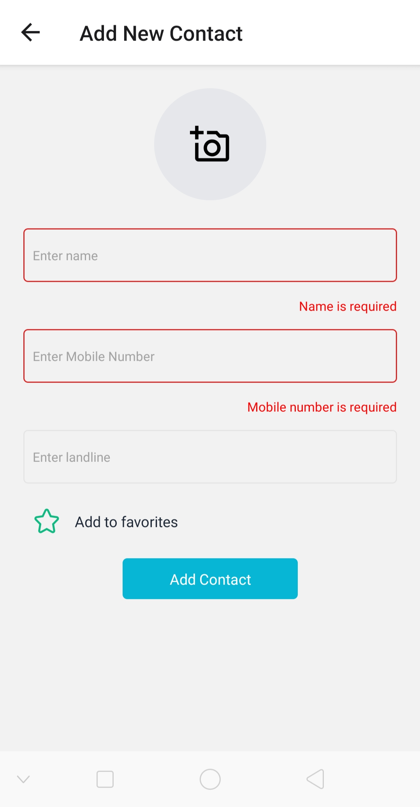

# About Project

- This project is a mobile app made using React native with Expo.
- This app can save, update, delete, list contacts you care about.
- It also has a feature to mark a contact as favorite/unfavorite.
- It contains following screens:-
  - List of contacts.
  - To create contact.
  - To update contact.
  - Favorite contacts.
  - Navigation drawer to switch between contact list screen and favorite contacts screen.
  - Camera screen to take photo.

## Tools Used

- Redux - For State management.
- SQLite database - To persist data.
- redux-thunk - To handle asynchronous calls.
  Storing data inside SQLite database is an asynchronous task, that's why we need redux-thunk.
- NativeBase.io - For styling. It is a "bootstrap"(styling library for web) of mobile app.

# Application Screenshots

### List of Contacts Screen


### Add new contact Screen


### Empty form submission



### Select profile picture


### Update contact


### Navigation drawer


### Favorite List Screen


### Camera Screen


# expo-template-native-base

The official NativeBase template for [Expo](https://docs.expo.io/)

## Usage

```sh
expo init my-app --template expo-template-native-base
```

## Warning!!!

- This app doesn't check for duplicate phone numbers.
- Clicking delete button will delete the contact without prompting for confirmation.
